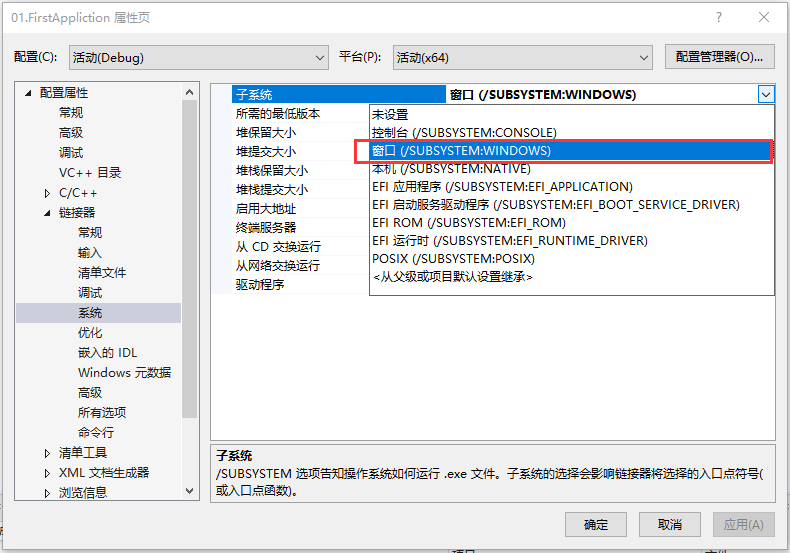

# 01.第一个程序

注意：使用vs2019创建window桌面向导会报错：error LNK2019: 无法解析的外部符号，该符号在函数 _main 中被引用的解决方法。**解决方法**：项目属性->链接器->子系统，更改为窗口。



## Hello World程序!
```
#include<Windows.h>

int WINAPI WinMain(HINSTANCE hInstance, HINSTANCE hPreInstance, PSTR szCmdLine, int iCmdShow) {
	MessageBox(NULL, TEXT("Hello ！！！"), TEXT("打招呼"), MB_OK);
	return 0;
}
```
